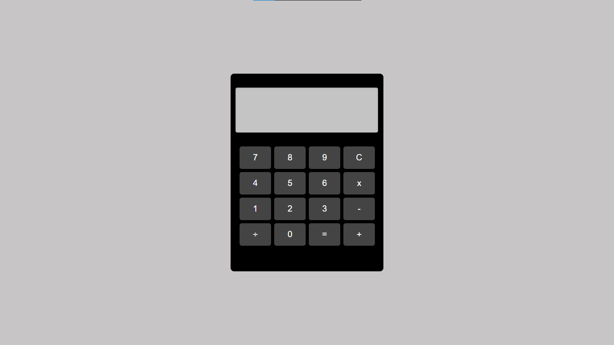

# Calculadora Digital
Este projeto é uma calculadora digital simples construída usando HTML, CSS e JavaScript. Ela apresenta um design limpo, com operações matemáticas básicas, como adição, subtração, multiplicação e divisão. A calculadora é responsiva, garantindo uma experiência fluida em diferentes tamanhos de tela, desde dispositivos móveis até grandes telas de desktop.

## Funcionalidades
<li>Operações Básicas: A calculadora suporta adição (+), subtração (-), multiplicação (x) e divisão (÷).
<li>Design Responsivo: O layout se ajusta conforme o tamanho da tela, garantindo que a calculadora fique boa tanto em dispositivos móveis quanto em grandes telas de desktop.
<li>Tratamento de Erros: Se houver uma operação inválida, a tela exibirá uma mensagem de erro.
<li>Botão Limpar: Permite que o usuário limpe a entrada atual.

## Tecnologias Utilizadas
<li>HTML: Fornece a estrutura e os elementos da calculadora.
<li>CSS: Usado para estilização e layout. Inclui regras de design responsivo usando media queries.
<li>JavaScript: Implementa a lógica da calculadora, incluindo o apêndice de valores na tela, a limpeza da tela e a realização de cálculos.

## Captura de Tela do projeto

